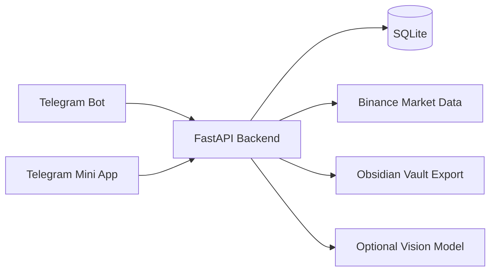

# Trading Assistant


Personal trading journal and Telegram Mini App for crypto trade tracking, risk control, session analytics, screenshots, market context, and portable Obsidian exports.

> This project is a portfolio-grade personal trading assistant. It does **not** provide financial advice, guaranteed signals, or automated exchange execution.

## Portfolio card

**Problem.** Active traders often keep trade plans, screenshots, risk notes, and post-trade reviews scattered across Telegram, screenshots, spreadsheets, and memory.

**Solution.** Trading Assistant turns Telegram into a structured trading cockpit:

- capture trades from chat commands or screenshots;
- track open risk, live PnL, stop/take observations, and session progress;
- keep journal notes linked to trades, screenshots, sessions, and market context;
- review setups with deterministic risk checks and heuristic rule scoring;
- export a complete Obsidian vault for visual analysis and long-term knowledge management.

**Why it matters.** The project combines product thinking, backend reliability, security hardening, UI/UX, data modeling, and trading-domain workflows in one full-stack application.

## Highlights

- Telegram bot for trade capture, journal notes, screenshots, alerts, and session commands.
- Telegram Mini App built as a trader dashboard with live prices, watchlist, open trades, charts, analytics, journal, sessions, and calculators.
- Risk engine for position sizing, leverage/margin estimation, fees, slippage, funding, and reward-to-risk.
- Public-market level monitor that reports stop/take observations without falsely claiming order execution.
- Trade/session/journal linking with owner isolation.
- Optional screenshot-to-trade draft extraction through a vision model, with clarification prompts instead of hallucinated orders.
- Obsidian vault export: Markdown, YAML properties, internal links, dashboard notes, daily notes, coin pages, and JSON Canvas maps.
- Production hardening: Telegram Mini App signature verification, allowlist auth, CSP, rate limiting, idempotency, atomic transitions, backup tooling, and regression tests.
- Multi-asset roadmap for crypto, stocks, ETF/funds, indices, forex, commodities, and futures through provider routing.

## Product surface



## Tech stack

- **Backend:** Python, FastAPI, python-telegram-bot, SQLite
- **Frontend:** Telegram Mini App, HTML/CSS/vanilla JavaScript
- **Market data:** Binance spot/futures adapter, provider-router roadmap
- **Quality:** pytest, ruff, node syntax checks, pip-audit, gitleaks CI
- **Deployment:** systemd unit examples, Caddy reverse proxy example, backup scripts

## Telegram commands

```text
/open
Монета: SOL
Сторона: лонг
Цена входа: 70.9
Стоп: 69.8
Тейк: 73
Количество позиций: 1.4
Плечо: 1
Причина входа: отбой от уровня

/edit 12 стоп 70.1 тейк 74 количество 1.2 5m перенес стоп после подтверждения
/note SOL ошибка: вошел без подтверждения
/trades
/close 12 73.8
/stats
/miniapp
```

Screenshots can be attached to `/open`, `/note`, and `/edit`. If vision extraction is configured, `/open` can ask the user for a screenshot and build a trade draft from visible order levels.

## Local development

```bash
cp .env.example .env
python3 -m venv .venv
source .venv/bin/activate
pip install -r requirements-dev.txt
python scripts/migrate.py data/trading_bot.sqlite3
```

Run the Telegram bot:

```bash
python -m trading_bot.main
```

Run the Mini App API:

```bash
uvicorn trading_bot.web_app:app --host 127.0.0.1 --port 8080
```

For real Telegram Mini App usage, open the dashboard through Telegram so signed `initData` is available. Direct URL `user_id` identity is intentionally not supported in the hardened source branch.

## Configuration

```env
TELEGRAM_BOT_TOKEN=token_from_botfather
ALLOWED_TELEGRAM_USER_IDS=123456789
APP_ENV=production
ENABLE_DEV_AUTH=false
AUTO_MIGRATE=false
BUSINESS_TIMEZONE=Europe/Moscow
DATABASE_PATH=data/trading_bot.sqlite3
MARKET=futures
TOP_LIMIT=10
ALERT_POLL_SECONDS=30
OPENAI_API_KEY=
OPENAI_VISION_MODEL=gpt-5.5
WEB_APP_URL=http://127.0.0.1:8080
WEB_HOST=127.0.0.1
WEB_PORT=8080
```

`OPENAI_API_KEY` is optional. Without it, screenshot recognition falls back to the manual `/open` template.

## Security and privacy

This repository is prepared to be public:

- `.env`, SQLite databases, media, logs, backups, local caches, and personal launch scripts are ignored.
- CI includes secret scanning with gitleaks.
- Telegram Mini App auth verifies signed `initData`.
- API owner isolation is covered by regression tests.
- Attachments are owner-checked before download.
- The Mini App ships CSP and other browser hardening headers.
- Trade mutations use idempotency and service-layer validation.

Before publishing your own fork, rotate any token that has ever appeared in a chat, terminal, screenshot, or local logs.

## Obsidian export

The project can generate a portable Obsidian vault:

- `Dashboard.md`
- `Sessions/`
- `Trades/`
- `Journal/`
- `Daily/`
- `Coins/`
- `Canvas/Trading Map.canvas`

Design details: [docs/obsidian-export.md](docs/obsidian-export.md).

## Model connections roadmap

The Mini App includes a `Модели` setup screen scaffold for future model connections:

- OpenAI API
- local OpenAI-compatible endpoints
- offline/manual mode
- task bindings for screenshot extraction, journal analysis, Obsidian reports, and trade review

Design details: [docs/model-connections.md](docs/model-connections.md).

## Multi-asset roadmap

Current live market data is crypto-focused through Binance. The planned provider router will support stocks, ETF/funds, indices, forex, commodities, and futures without faking prices when a data provider is not configured.

Design details: [docs/multi-asset-market.md](docs/multi-asset-market.md).

## Quality checks

```bash
ruff check .
node --check mini_app/app.js
pytest -q
pip-audit -r requirements.txt
```

## Repository structure

```text
trading_bot/        Bot, FastAPI app, domain services, repositories, market adapters
mini_app/           Telegram Mini App frontend
scripts/            Migration and backup helpers
deploy/             Example Caddy and systemd deployment files
docs/               Architecture, threat model, deployment, export designs
tests/              Unit, integration, security, and frontend static tests
```

## Status

The project is actively developed as a personal trading assistant and portfolio project. Production deployment requires owner-specific Telegram tokens, allowlist IDs, HTTPS, backup policy, and private database/media storage.

## License

Source-available portfolio project. See [LICENSE](LICENSE). If you want this repository to be open-source, replace the license with MIT, Apache-2.0, or another OSI-approved license before publishing.

## Disclaimer

Trading involves risk. This software is for journaling, analysis, and workflow automation. It does not execute exchange orders and does not guarantee profit.
