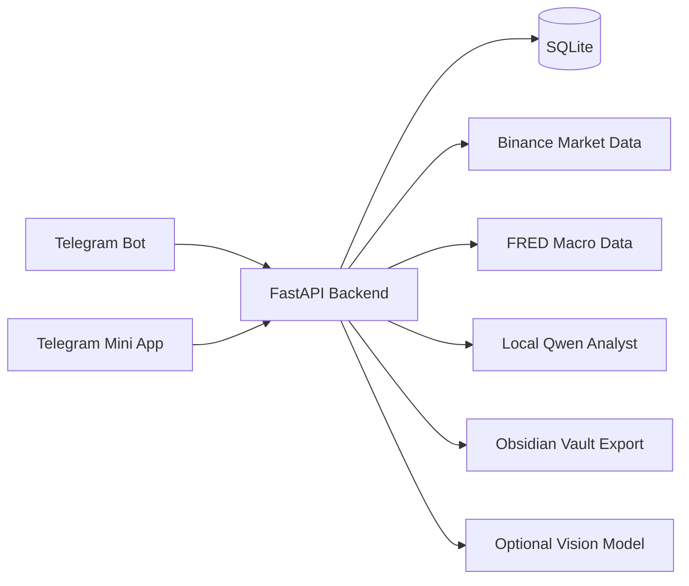

# Trading Assistant


Personal trading journal and Telegram Mini App for trade tracking, risk control, session analytics, screenshots, market context, crisis monitoring, and portable Obsidian exports.

> This project is a portfolio-grade personal trading assistant. It does **not** provide financial advice, guaranteed signals, or automated exchange execution.

## Portfolio card

**Problem.** Active traders often keep trade plans, screenshots, risk notes, and post-trade reviews scattered across Telegram, screenshots, spreadsheets, and memory.

**Solution.** Trading Assistant turns Telegram into a structured trading cockpit:

- capture trades from chat commands or screenshots;
- track open risk, live PnL, stop/take observations, and session progress;
- keep journal notes linked to trades, screenshots, sessions, and market context;
- review setups with deterministic risk checks and heuristic rule scoring;
- export a complete Obsidian vault for visual analysis and long-term knowledge management.

**Why it matters.** The project combines product thinking, backend reliability, security hardening, UI/UX, data modeling, and trading-domain workflows in one full-stack application.

## Highlights

- Telegram bot for trade capture, journal notes, screenshots, alerts, and session commands.
- Telegram Mini App built as a trader dashboard with live prices, watchlist, open trades, charts, analytics, journal, sessions, and calculators.
- Crisis Radar foundation with immutable methodologies, historical data vintages, configurable thresholds, cross-indicator market stages, and RU/EN explanations.
- Read-only local Crisis Radar analyst through Ollama and `qwen3.5:9b`, with structured output and evidence constrained to saved radar data.
- One persistent RU/EN locale for the entire Mini App, including navigation, trading tools, models, calculator output, Crisis Radar, dynamic cards, dates, and number formatting.
- Risk engine for position sizing, leverage/margin estimation, fees, slippage, funding, and reward-to-risk.
- Public-market level monitor that reports stop/take observations without falsely claiming order execution.
- Trade/session/journal linking with owner isolation.
- Optional screenshot-to-trade draft extraction through a vision model, with clarification prompts instead of hallucinated orders.
- Obsidian vault export: Markdown, YAML properties, internal links, dashboard notes, daily notes, coin pages, and JSON Canvas maps.
- Production hardening: Telegram Mini App signature verification, allowlist auth, CSP, rate limiting, idempotency, atomic transitions, backup tooling, and regression tests.
- Multi-asset roadmap for crypto, stocks, ETF/funds, indices, forex, commodities, and futures through provider routing.

## Product surface


```mermaid
flowchart LR
    TG[Telegram Bot] --> API[FastAPI Backend]
    Mini[Telegram Mini App] --> API
    API --> DB[(SQLite)]
    API --> Binance[Binance Market Data]
    API --> FRED[FRED Macro Data]
    API --> Ollama[Local Qwen Analyst]
    API --> Export[Obsidian Vault Export]
    API --> Vision[Optional Vision Model]
```

## Tech stack

- **Backend:** Python, FastAPI, python-telegram-bot, SQLite
- **Frontend:** Telegram Mini App, HTML/CSS/vanilla JavaScript
- **Market data:** Binance spot/futures adapter, provider-router roadmap
- **Quality:** pytest, ruff, node syntax checks, pip-audit, gitleaks CI
- **Deployment:** systemd unit examples, Caddy reverse proxy example, backup scripts

## Telegram commands

```text
/open
Монета: SOL
Сторона: лонг
Цена входа: 70.9
Стоп: 69.8
Тейк: 73
Количество позиций: 1.4
Плечо: 1
Причина входа: отбой от уровня

/edit 12 стоп 70.1 тейк 74 количество 1.2 5m перенес стоп после подтверждения
/note SOL ошибка: вошел без подтверждения
/trades
/close 12 73.8
/stats
/miniapp
```

Screenshots can be attached to `/open`, `/note`, and `/edit`. If vision extraction is configured, `/open` can ask the user for a screenshot and build a trade draft from visible order levels.

## Local development

```bash
cp .env.example .env
python3 -m venv .venv
source .venv/bin/activate
pip install -r requirements-dev.txt
python scripts/migrate.py data/trading_bot.sqlite3
python -m scripts.crisis_radar bootstrap
```

Run the Telegram bot:

```bash
python -m trading_bot.main
```

Run the Mini App API:

```bash
uvicorn trading_bot.web_app:app --host 127.0.0.1 --port 8080
```

For real Telegram Mini App usage, open the dashboard through Telegram so signed `initData` is available. Direct URL `user_id` identity is intentionally not supported in the hardened source branch.

## Configuration

```env
TELEGRAM_BOT_TOKEN=token_from_botfather
ALLOWED_TELEGRAM_USER_IDS=123456789
APP_ENV=production
ENABLE_DEV_AUTH=false
AUTO_MIGRATE=false
BUSINESS_TIMEZONE=Europe/Moscow
DATABASE_PATH=data/trading_bot.sqlite3
MARKET=futures
TOP_LIMIT=10
ALERT_POLL_SECONDS=30
OPENAI_API_KEY=
OPENAI_VISION_MODEL=gpt-5.5
WEB_APP_URL=http://127.0.0.1:8080
WEB_HOST=127.0.0.1
WEB_PORT=8080
CRISIS_RADAR_ENABLED=true
FRED_API_KEY=
BEA_API_KEY=
EIA_API_KEY=
CRISIS_RADAR_SYNC_MINUTES=360
CRISIS_AGENT_ENABLED=true
CRISIS_AGENT_PROVIDER=ollama
OLLAMA_BASE_URL=http://127.0.0.1:11434
CRISIS_AGENT_MODEL=qwen3.5:9b
CRISIS_AGENT_API_KEY=
CRISIS_AGENT_BASE_URL=
ANTHROPIC_API_KEY=
CRISIS_AGENT_TIMEOUT_SECONDS=90
CRISIS_AGENT_RATE_LIMIT=6
CRISIS_AGENT_KEEP_ALIVE_MINUTES=10
CRISIS_AGENT_COOLDOWN_SECONDS=120
```

`OPENAI_API_KEY` is optional. Without it, screenshot recognition falls back to the manual `/open` template.

## Crisis Radar

`starter-v8` is retained as an immutable baseline and `candidate-v10` remains the production-primary deterministic output. `candidate-v11` is implemented beside it as a shadow methodology: `indicator-score-v2`, signed OI states, dependency-cluster deduplication, intensity plus independent-systemic-breadth stage, numeric/news coverage gates, event decay, recovery, causal diff, exposure overlay and live scorecards are calculated and persisted without rewriting v10 snapshots. v11 is deliberately not promoted: the current causal replay has zero eligible historical signals after its fail-closed coverage gate, so live probability remains `null`. The exact contract and evidence are in [`docs/crisis-radar-v2-production-plan.md`](docs/crisis-radar-v2-production-plan.md), [`docs/crisis-radar-v2-production-progress.md`](docs/crisis-radar-v2-production-progress.md), [`docs/crisis-radar-v2-runtime-contract.json`](docs/crisis-radar-v2-runtime-contract.json), and [`docs/crisis-radar-model-card.md`](docs/crisis-radar-model-card.md).

The repository is distributed as a self-hosted product, not a shared SaaS. The owner supplies Telegram/data credentials, keeps the database and media privately, and can choose `basic-local`, `advanced-local`, or `server`. The server profile requires a permanent HTTPS address, an immutable release ID, verified encrypted off-host backups, restore drills, and a real 14-day radar canary before the release may be called production-ready.

`starter-v8` preserves the temporal-stability rules added in v6 without hiding the raw threshold result. Daily, weekly, and intraday non-critical escalations require two distinct observations; monthly, quarterly, and annual releases remain immediate, and critical crossings are never delayed. A 10% recovery margin prevents threshold flicker. The detailed UI exposes raw/effective bands, distinct-point confirmation, and hysteresis holds. Scenario notifications use a six-hour cooldown, while a more severe critical escalation bypasses it.

Five joint-confirmation scenarios are persisted independently from the market stage: global slowdown/recession, systemic financial stress, an oil-driven inflation shock, a crypto leverage unwind, and a China hard landing. Their statuses are `inactive`, `watch`, `elevated`, or `confirmed`; data coverage is reported separately as confidence. Transitions into `elevated`/`confirmed` and recoveries create deduplicated Telegram events. Deliveries are retried up to three times and the first saved market state never sends a false alert.

The BIS credit-gap warning and danger levels use the Basel III guide points of 2 and 10 percentage points. The 20-point critical band is an intentionally conservative internal escalation threshold. These values inform a joint scenario; they never trigger a crisis conclusion by themselves. World Bank annual growth and OECD CLI momentum thresholds are transparent starter heuristics and should later be calibrated on historical vintages. The OECD adapter uses the six-month change because OECD guidance emphasizes the direction of the CLI rather than treating an index level below 100 as a mechanical crisis threshold.

The radar also persists a 45-day FRED calendar for selected high- and medium-importance US macro releases. Only the official date is displayed when the source does not publish a time. Telegram sends deduplicated planned summaries on Wednesday at 22:30 and Saturday at 12:00 in `BUSINESS_TIMEZONE`; failed deliveries retry through the same outbox used by scheduled jobs.

Schema v10 adds a deterministic official-news evidence layer. Federal Reserve monetary-policy and ECB press RSS feeds are polled every 15 minutes, sanitized, canonicalized, deduplicated, and linked to scenarios by versioned rules. News is contextual evidence only: it cannot change an indicator band, market stage, or scenario status without numerical confirmation. DTD/entity XML, non-official item domains, active HTML, oversized payloads, and malformed timestamps are rejected. Relevant releases appear in the RU/EN Mini App and in planned Telegram summaries.

With the v2 news flag enabled, the same 15-minute job covers ten official RSS feeds (Fed, ECB, SEC, CFTC, BIS, BOJ, RBI, BoE, BoC, FDIC) and the official HKMA press-release JSON API. HKMA is a separate Hong Kong/Greater China banking and liquidity channel, not an RSS compatibility shim. Its response header, record schema, date, count, duplicates and allowlisted item host are validated before persistence. GDELT remains discovery-only, and an unavailable news channel reduces news coverage rather than fabricating a stable or crisis state.

Schema v11 adds private, owner-isolated conversations with a local `qwen3.5:9b` analyst. The backend composes a bounded read-only context from the deterministic overview, scenario states, indicator thresholds, official news, and release calendar. Ollama is restricted to localhost, redirects are disabled, JSON responses are canonicalized server-side, and cited evidence codes are filtered through a server-built allowlist. News text is authoritative only as quoted evidence, never as instructions; instruction-like titles or summaries are redacted from the model context while the original stored news remains unchanged. The model has no write tools and cannot alter signals, thresholds, trades, or notifications. Its answer is an explanatory layer, not a financial recommendation or deterministic crisis signal.

Schema v12 stores the grounding result for every assistant message. The verifier rejects unsupported numbers, missing evidence, scenario-count errors, and any conflation of scenario activation with data confidence across the answer, limitations, and suggestions. The Mini App labels each response as grounded in saved data or requiring manual verification. RU/EN golden cases cover missing data, prompt injection, group-versus-scenario semantics, evidence allowlisting, language, and latency; malformed model output gets one bounded retry and then an explicit non-analytical fallback. A generation timeout is not retried, because Ollama can continue the abandoned generation and block its local queue; instead the chat persists a transparent ungrounded timeout response while deterministic cards remain available. A runtime circuit breaker then pauses new generations for a configurable cooldown, while the status API distinguishes a model installed on disk from one currently loaded in memory. Successful generations keep the model warm for a bounded period.

The same read-only grounded contract can be switched with `CRISIS_AGENT_PROVIDER` between local Ollama, official OpenAI, official Anthropic, and an OpenAI-compatible endpoint. Remote URLs are validated, redirects are disabled, payloads are bounded, and provider keys never appear in API responses or sanitized failures. Ollama remains the default and no cloud data transfer occurs unless the owner explicitly selects and configures a remote provider.

Schema v13 adds the first leakage-safe historical calibration slice. Uncalibrated scenario scores and retrospective event labels enter as separate timelines. Every prediction can train only on samples whose forward horizon had fully ended before that prediction timestamp. Percentages remain `null` until the global sample, positive/negative class, and score-bin minimums are all satisfied. Successful runs persist their parameters, predictions, last eligible training horizon, Brier score, baseline Brier score, log loss, precision/recall, false-alert rate, lead time, and calibration curve. This is an audit and calibration layer; it does not retroactively change deterministic cards or alerts.

Schema v14 adds immutable official event catalogs and deterministic historical replay from saved as-of observations. Replay signals keep exact observation IDs and checksums, exclude future revisions, active-event points, retrospectively revised rows, and right-censored horizons, and never touch live snapshots or notifications. A historical percentage is withheld unless it covers at least three independent positive episodes, has non-zero recall, and strictly beats the walk-forward base-rate Brier score. Historical results are always labeled retrospective and are not exposed as a live probability without a separately validated application to the current live score.

RU/EN is an application-wide preference rather than a Crisis Radar-only setting. A single header control persists the locale in the browser, changes `lang`, rerenders live trading/market/calculator content, requests localized Crisis Radar data, and applies locale-aware dates, times, and numeric formatting. Stored journal entries, trade notes, and previous agent messages remain in the language in which the owner created them.

```bash
python -m scripts.crisis_radar migrate
python -m scripts.crisis_radar bootstrap
python -m scripts.crisis_radar sync
python -m scripts.crisis_radar sync --source ecb
python -m scripts.crisis_radar sync --source world_bank
python -m scripts.crisis_radar sync --source bis
python -m scripts.crisis_radar sync --source oecd
python -m scripts.crisis_radar sync --source news
python -m scripts.crisis_radar sync --source bybit
python -m scripts.crisis_radar recompute
python -m scripts.crisis_radar status --locale ru
python -m scripts.crisis_radar calendar --locale ru --days 30
python -m scripts.crisis_radar news --locale ru --days 14 --limit 20
python -m scripts.evaluate_crisis_agent --mode fast --timeout 120 --runs 2 --pause 2
python -m scripts.backtest_crisis_radar --input data/private/global-recession-backtest.json --dry-run
python -m scripts.backtest_crisis_radar --input data/private/global-recession-backtest.json
python -m scripts.crisis_radar backfill --source fred --from 1990-01-01 --through 2026-07-21
python -m scripts.crisis_radar backfill --source bybit --from 2020-01-01 --through 2026-07-20
python -m scripts.crisis_radar derive-labels --through 2026-07-20
python -m scripts.replay_crisis_radar --scenario financial_stress --from 1998-08-26 --through 2016-09-01 --cadence-days 7 --horizon-days 30 --minimum-coverage 0.25 --dry-run
python -m scripts.soak_check --base-url http://127.0.0.1:8080 --duration-seconds 300
```

FRED, BEA, and EIA keys enable their respective live synchronizations. ECB, Eurostat, World Bank, BIS, OECD, Bybit, all configured official RSS feeds, and the HKMA press-release API use public endpoints without keys. World Bank, BIS, and OECD run in a separate daily job because their macro series update slowly and the BIS bulk archive is substantially larger than an ordinary API response. The methodology and UI can be tested entirely offline with fixtures. The dashboard deliberately does not show a single “magic crash probability”: the overview communicates the current market stage and breadth of deterioration, while technical scores and source health stay behind the detailed-mode toggle.

FRED exposes only ten years of daily S&P 500 history and identifies that series as S&P Dow Jones copyrighted data. The application keeps fetched observations in the owner's private database; the repository and self-hosted package do not redistribute an S&P dataset.

Read-only owner-authenticated endpoints:

- `GET /api/crisis-radar/overview?locale=ru|en`
- `GET /api/crisis-radar/calendar?locale=ru|en&days=30`
- `GET /api/crisis-radar/news?locale=ru|en&days=14&limit=20`
- `GET /api/crisis-radar/world?locale=ru|en`
- `GET /api/crisis-radar/sources/health?locale=ru|en`
- `GET /api/crisis-radar/opportunities?locale=ru|en&limit=10`
- `GET /api/crisis-radar/indicators/{code}/history?limit=500`
- `GET /api/crisis-radar/scenarios/{code}/calibration`
- `GET /api/crisis-radar/scenarios/{code}/event-catalog`
- `GET /api/crisis-radar/backtests/{id}`
- `GET /api/crisis-radar/replays/{id}`
- `GET /api/crisis-radar/agent/status`
- `GET /api/crisis-radar/agent/threads`
- `GET /api/crisis-radar/agent/threads/{id}`
- `POST /api/crisis-radar/agent/chat`

Opportunity research remains a separate module so it can be tested without contaminating the raw data pipeline. Local-agent synthesis is already separate from and subordinate to that deterministic pipeline.

The official and separately marked derived catalogs, replay, walk-forward input contract, and interpretation rules are documented in [`docs/crisis-radar-backtest.md`](docs/crisis-radar-backtest.md). Scenarios without a defensible official label definition retain explicit empty official catalogs. Derived research labels never bypass the calibration gates, so no percentage is fabricated.

## Security and privacy

This repository is prepared to be public:

- `.env`, SQLite databases, media, logs, backups, local caches, and personal launch scripts are ignored.
- CI includes secret scanning with gitleaks.
- Telegram Mini App auth verifies signed `initData`.
- API owner isolation is covered by regression tests.
- Attachments are owner-checked before download.
- The Mini App ships CSP and other browser hardening headers.
- Trade mutations use idempotency and service-layer validation.

Before publishing your own fork, rotate any token that has ever appeared in a chat, terminal, screenshot, or local logs.

## Obsidian export

The project can generate a portable Obsidian vault:

- `Dashboard.md`
- `Sessions/`
- `Trades/`
- `Journal/`
- `Daily/`
- `Coins/`
- `Canvas/Trading Map.canvas`

Design details: [docs/obsidian-export.md](docs/obsidian-export.md).

## Model connections

The Mini App reports the actual backend-selected provider and read-only task bindings. Secrets remain in backend environment variables and are never accepted by or returned to the browser. Supported analyst providers are:

- OpenAI API
- local OpenAI-compatible endpoints
- offline/manual mode
- truthful bindings for screenshot extraction, journal analysis, Obsidian reports, trade review, and Crisis Radar

An optional encrypted connection manager for changing providers from the UI remains a future convenience feature; it is not required for the self-hosted release.

Design details: [docs/model-connections.md](docs/model-connections.md).

## Multi-asset roadmap

Current live market data is crypto-focused through Binance. The planned provider router will support stocks, ETF/funds, indices, forex, commodities, and futures without faking prices when a data provider is not configured.

Design details: [docs/multi-asset-market.md](docs/multi-asset-market.md).

## Quality checks

```bash
ruff check .
node --check mini_app/app.js
pytest -q
pip-audit -r requirements.txt
```

## Repository structure

```text
trading_bot/        Bot, FastAPI app, domain services, repositories, market adapters
mini_app/           Telegram Mini App frontend
scripts/            Migration and backup helpers
deploy/             Example Caddy and systemd deployment files
docs/               Architecture, threat model, deployment, export designs
tests/              Unit, integration, security, and frontend static tests
```

## Status

The project is actively developed as a personal trading assistant and portfolio project. Production deployment requires owner-specific Telegram tokens, allowlist IDs, HTTPS, backup policy, and private database/media storage.

## License

Source-available portfolio project. See [LICENSE](LICENSE). If you want this repository to be open-source, replace the license with MIT, Apache-2.0, or another OSI-approved license before publishing.

## Disclaimer

Trading involves risk. This software is for journaling, analysis, and workflow automation. It does not execute exchange orders and does not guarantee profit.
